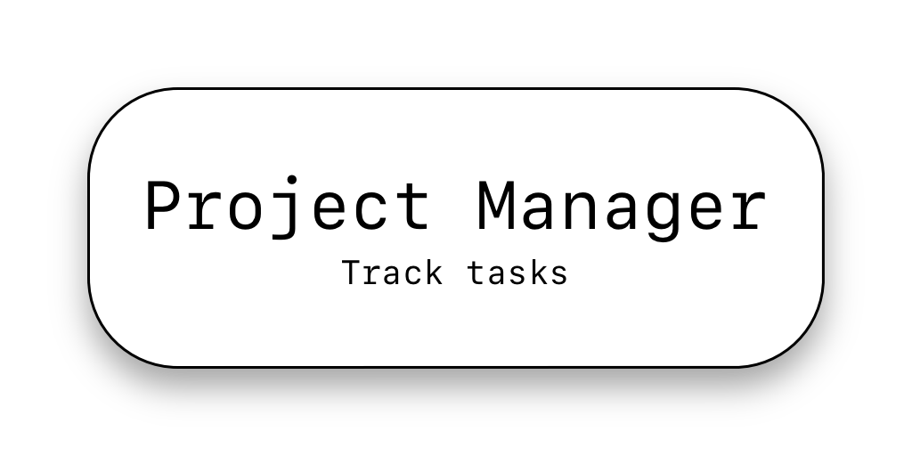
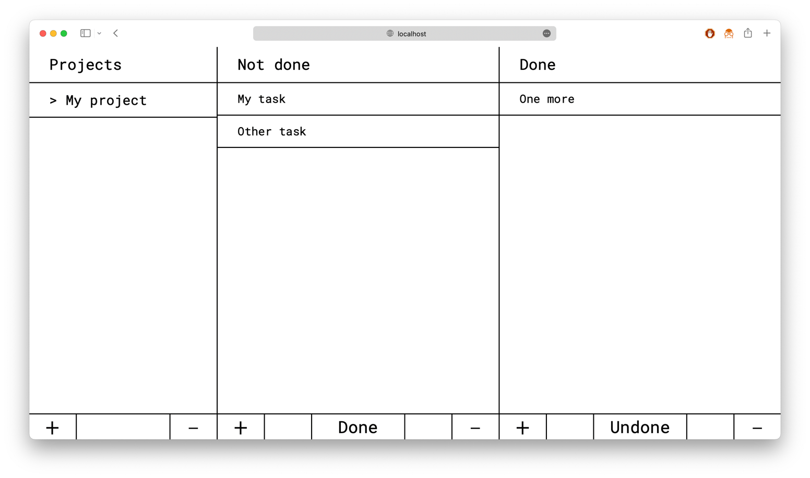
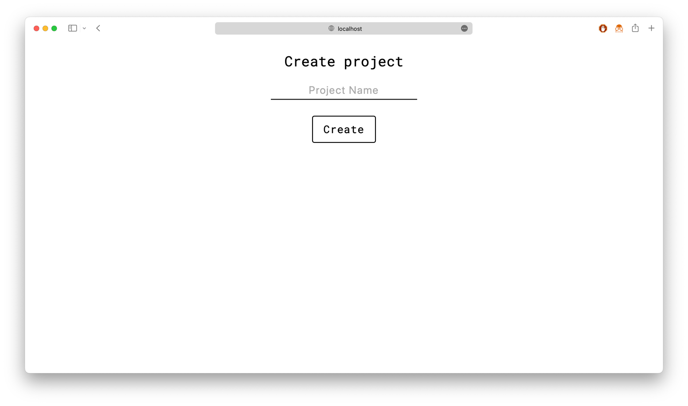
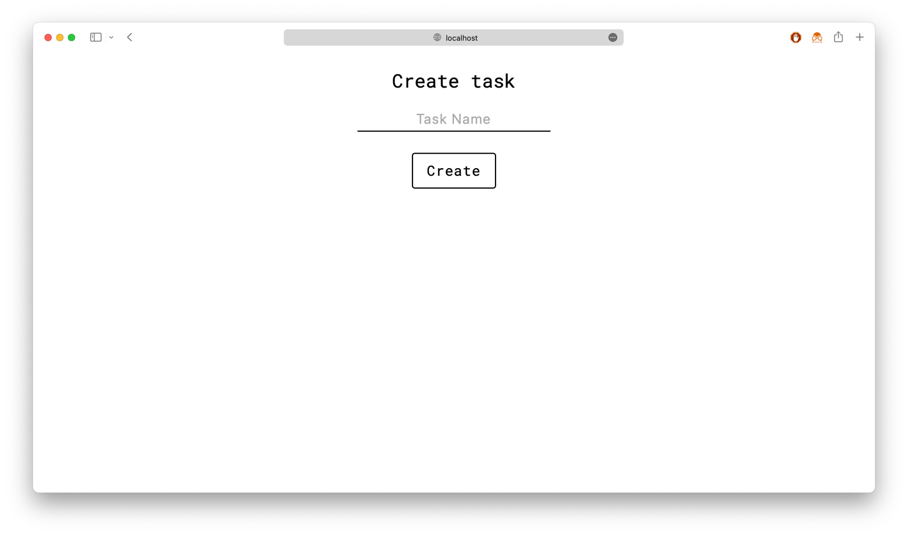
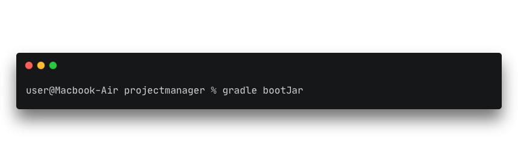
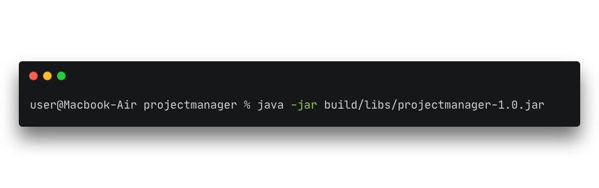

---
### What is it?
Project Manager is lightweight ToDo-list webapp. 
It can create project, create Tasks in project, make tasks done/undone.

### Screenshots




### How to run
Prerequisites:
 - Java 17 or higher
 - Gradle
 - Postgres (default address is ```localhost:5432/projectmanager```, change in ```application.properties```)

Steps:
1. 
2. 

Done!

### Technologies
 - Spring Boot
 - Spring Web
 - Spring Data
 - Thymeleaf
 - Postgres

### From author
If you like my work star this repo!